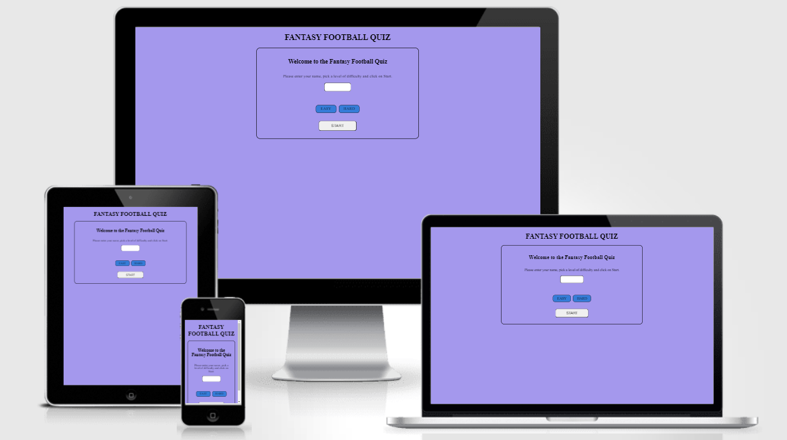
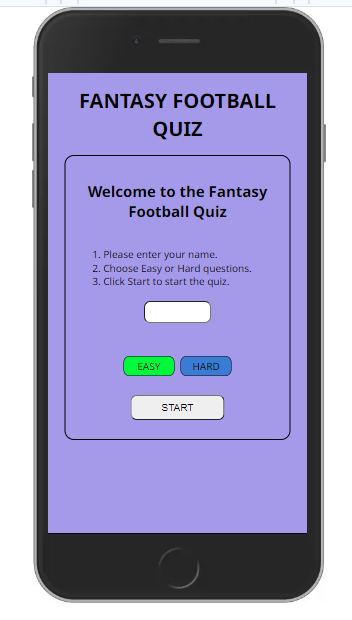
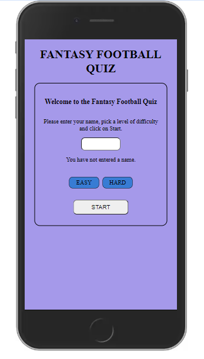
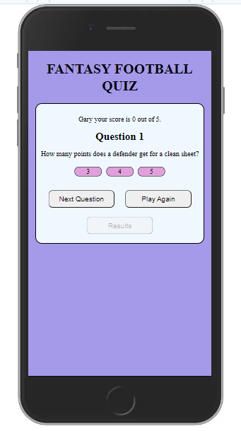
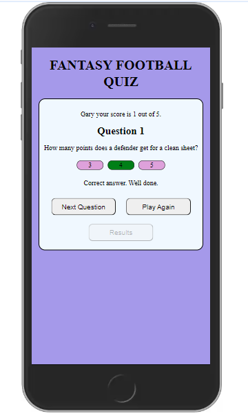
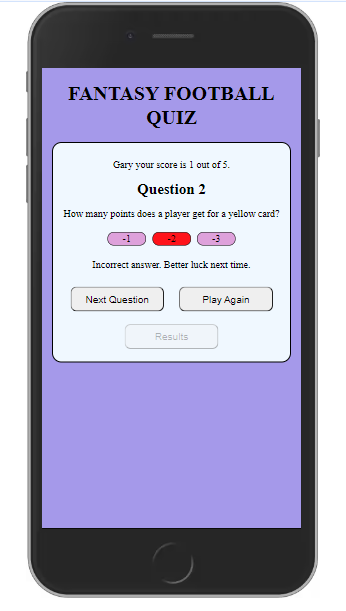
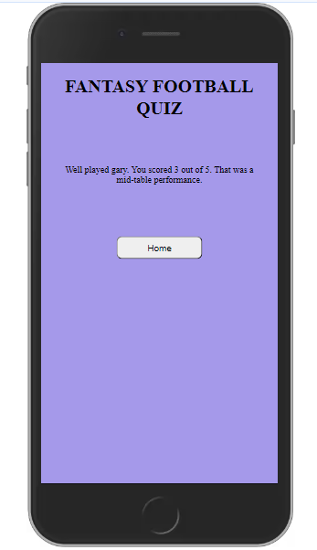

# Fantasy Football Quiz

## Introduction

The Fantasy Football Quiz is for people who play the Fantasy Premier League Fantasy Football game. There are currently over 10 million players worldwide. The questions in the quiz are regarding what players get points for in the Fantasy Football game.

## Table of Contents

* [User Stories](#user-stories)
* [Wireframes](#wireframes)
* [Design](#design)
* [Features](#features)
* [Responsiveness](#responsiveness)
* [Testing](#testing)
* [Deployment](#deployment)
* [Credits](#credits)

## User Stories

* As a user I want to test my knowledge about the Fantasy Premier League Fantasy Football game.
* As a user I want to be able to enter my name before I start the quiz.
* As a user I want to be able to choose an answer from a selection of possible choices.
* As a user I want to know if I got the question correct or incorrect.
* As a user I want to how many questions I got correct as I go through the questions.
* As a user I want to know my total score at the end of the game.
* As a user I want to be told how well I did and if I can improve.

## Wireframes

I used [Balsamiq](https://balsamiq.com/) to create wireframes for my website to plan the layout of the pages. I found this very useful when I started writing the code for the website.

* Mobile View

  * [Welcome Area](documentation/wireframes/mobile-welcome-area.png)
  * [Question Area](documentation/wireframes/mobile-question-area.png)
  * [Results Area](documentation/wireframes/mobile-result-area.png)

* Tablet View

  * [Welcome Area](documentation/wireframes/tablet-welcome-area.png)
  * [Question Area](documentation/wireframes/tablet-question-area.png)
  * [Results Area](documentation/wireframes/tablet-result-area.png)

* Laptop/Desktop View

  * [Welcome Area](documentation/wireframes/desktop-welcome-area.png)
  * [Question Area](documentation/wireframes/desktop-question-area.png)
  * [Results Area](documentation/wireframes/desktop-result-area.png)

[Back to Top](#fantasy-football-quiz)

## Design

### Color Scheme

### Font

[Back to Top](#fantasy-football-quiz)

## Features

### Welcome Area

### Question Area

### Results Area

[Back to Top](#fantasy-football-quiz)

## Responsiveness

[Back to Top](#fantasy-football-quiz)

## Testing

[Back to Top](#fantasy-football-quiz)

## Deployment

[Back to Top](#fantasy-football-quiz)

## Credits

[Back to Top](#fantasy-football-quiz)
