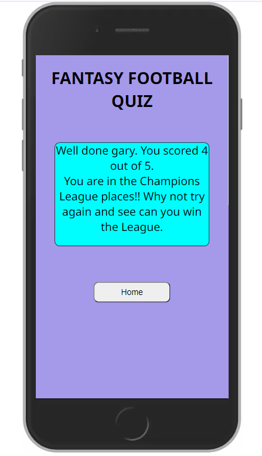
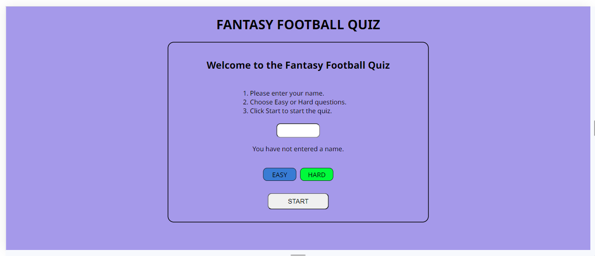

# Fantasy Football Quiz

Click [here](https://soro82.github.io/fantasy-football-quiz/) for the live link.

## Introduction

The Fantasy Football Quiz is for people who play the Fantasy Premier League Fantasy Football game. There are currently over 10 million players worldwide. The questions in the quiz are regarding what players get points for in the Fantasy Football game.

## Table of Contents

* [User Stories](#user-stories)
* [Wireframes](#wireframes)
* [Design](#design)
* [Features](#features)
* [Responsiveness](#responsiveness)
* [Testing](#testing)
* [Deployment](#deployment)
* [Credits](#credits)

## User Stories

* As a user I want to test my knowledge about the Fantasy Premier League Fantasy Football game.
* As a user I want to be able to enter my name before I start the quiz.
* As a user I want to be able to choose an answer from a selection of possible choices.
* As a user I want to know if I got the question correct or incorrect.
* As a user I want to know how many questions I got correct as I go through the questions.
* As a user I want to know my total score at the end of the game.
* As a user I want to be told how well I did and if I can improve.

## Wireframes

I used [Balsamiq](https://balsamiq.com/) to create wireframes for my website to plan the layout of the pages. I found this very useful when I started writing the code for the website.

* Mobile View

  * [Welcome Area](documentation/wireframes/mobile-welcome-area.png)
  * [Question Area](documentation/wireframes/mobile-question-area.png)
  * [Results Area](documentation/wireframes/mobile-result-area.png)

* Tablet View

  * [Welcome Area](documentation/wireframes/tablet-welcome-area.png)
  * [Question Area](documentation/wireframes/tablet-question-area.png)
  * [Results Area](documentation/wireframes/tablet-result-area.png)

* Laptop/Desktop View

  * [Welcome Area](documentation/wireframes/desktop-welcome-area.png)
  * [Question Area](documentation/wireframes/desktop-question-area.png)
  * [Results Area](documentation/wireframes/desktop-result-area.png)

[Back to Top](#fantasy-football-quiz)

## Design

### Color Scheme

* I chose `rgb(164, 152, 237)` for the background color because the color people associate most with Fantasy Football is purple.
* I googled the official colors of the Fantasy Football website but the purple they use `(rgb(56,0,60)`) was too dark to see the features on my quiz. They use it for banners on the website.
* They also use a light blue color `rgb(4,245,255)` but this was too bright for my quiz. I used a similar light blue (aqua) for the message background in the Results area.
* I used `rgb(53, 124, 216)` and `rgb(19, 251, 19)` for the "Easy" and "Hard" buttons to make them stand out on the screen and they look good against the background color.
* I chose green and red for correct and incorrect answers as these are known worldwide as positive and negative respectively.

### Font

* I decided to use the "Noto Sans" font family for my website.
* I googled the top ten font families to use on websites and I thought "Noto Sans" was a good font for a quiz. There is not much text on the screen at any one time so I wanted it to stand out more to make it look more like a game.
* I imported them from [Google Fonts](https://fonts.google.com/)

[Back to Top](#fantasy-football-quiz)

## Features

### Welcome Area

* The Welcome Area has a message at the top to welcome the user to the quiz.
* The user is asked to enter their name in the box underneath and choose a level of difficulty, easy or hard.
* The "Easy" button is initially selected and the questions are set to the easy questions when the quiz is loaded.
* Next the user must click the "Start" button to start the quiz. This will hide the Welcome Area and display the Question Area.

* If the user clicks "Start" without entering a name, a message will appear above the difficulty level buttons to inform them of this.
* The "Start" button will not work until they have entered a name.

### Question Area

* When the Question Area is loaded/displayed the user's name is displayed at the top and their current score.
* If the user enters their name in lowercase their name will be displayed with the first letter in uppercase.
* When the user gets a question right their score increase by 1.
* The question number is displayed underneath and the number increases by 1 every time the user clicks on the "Next Question" button.
* Below this is the current question. This also changes when the user clicks on the "Next Question" button.
* Next are the three possible answers to the current question. Their values change for each question.
* The "Next Question" button allows the user to move to the next question. 
* The "Play Again" button will work at any time, if user wishes to start the quiz again.
* The "Results" button is disabled until the user answers all the questions. 

* When the user clicks on the correct answer, the answer they clicked on turns green.
* A message is displayed below the answers to inform them of this.
* When the user clicks on the "Next Question" button, this message will disappear.

* When the user clicks on an incorrect answer, the answer they clicked on turns red.
* A message is displayed below the answers to inform them of this.

### Results Area

* When the user answers the last question, the "Next Question" button is disabled and the "Results" button is enabled.

* When the "Results button is clicked by the user, the Question Area is hidden and the Results Area is displayed.
* A message is displayed with the user's name included. 
* It also includes the user's final score and a sentence about their score.
* The sentence is different, depending on what their final score was.
* The message also includes a sentence to encourage the user to play again.
* Below the message is the "Home" button.
* When the user clicks on the "Home" button, the Results Area is hidden and the Welcome Area is displayed.

### Features Left To Implement
* A timer for the hard questions.
* A leader board.

[Back to Top](#fantasy-football-quiz)

## Responsiveness

* The quiz was tested on mobile phone, tablet and desktop screen sizes and no issues were identified.
* In the Features section you can see how it looks on mobile phone screen sizes.
* On tablets and desktop screen sizes the border around the Welcome Area and the Question Area expands to a maximum width of 600 pixels.
* The buttons in the Question Area are displayed in a column on mobile phone screens.
* The buttons in the Question Area are displayed in a row on tablets and desktop screens.

Tablet Screen Size

Desktop Screen Size

[Back to Top](#fantasy-football-quiz)

## Testing

* I tested the quiz using Chrome, Firefox and Microsoft Edge.
* I confirmed that the website is responsive and fully functional using Chrome devtools and https://responsivedesignchecker.com/.

| Location | Test | Expected Result | Result |
| :------: | :--: | :-------------: | :----: |
| Welcome Area | No user name entered | Error message appears below input box | Passed |
| Welcome Area | Less than 2 letters entered for username | Error message appears below input box | Passed |
| Welcome Area | More than 15 letters entered for username | Error message appears below input box | Passed |
| Welcome Area | "Hard" clicked by user | "Hard" turns green and "Easy" turns blue | Passed |
| Welcome Area | "Easy" clicked by user | "Easy" turns green and "Hard" turns blue | Passed |
| Welcome Area | "Start" clicked by user | Question Area is displayed | Passed |
| Question Area | Correct answer clicked by user | User's score increases by 1 | Passed |
| Question Area | Incorrect answer clicked by user | User's score stays the same | Passed |
| Question Area | Correct answer clicked by user | Answer box turns green | Passed |
| Question Area | Incorrect answer clicked by user | Answer box turns red | Passed |
| Question Area | "Next Question" button | Enabled | Passed |
| Question Area | "Play Again" button | Enabled | Passed |
| Question Area | "Results" button | Enabled | Passed |
| Question Area | "Next Question" clicked | Question number increases by 1 | Passed |
| Question Area | "Next Question" clicked | Question displayed changes | Passed |
| Question Area | "Next Question" clicked | Answer buttons values changes | Passed |
| Question Area | "Play Again" clicked by user | Welcome Area is displayed | Passed |
| Question Area | Final question displayed | "Next Question" button Disabled | Passed |
| Question Area | Final question displayed | "Results" button Enabled | Passed |
| Question Area | "Results" clicked by user | Results Area is displayed | Passed |
| Results Area | Results message displayed | User's name is included | Passed |
| Results Area | Results message displayed | User's score is correct | Passed |
| Results Area | User scores less than 3 | Results message is correct | Passed |
| Results Area | User scores less 3 | Results message is correct | Passed |
| Results Area | User scores less 4 | Results message is correct | Passed |
| Results Area | User scores less 5 | Results message is correct | Passed |
| Results Area | "Home" clicked by user | Welcome Area is displayed | Passed |

### Bugs

##### Fixed Bugs

* I was trying to get the buttons centered in the Question Area. I tried "align-items: center" and then "justify-content: center" but it wasn't working. Eventually, I got it working with "text-align: center".
* I was using ".innerText" to get the user's name and store it in a variable but it was not working so I went back over the Love Maths project and realised that I needed to use ".value" instead.
* I had a bug with the user's current score. 
  * It worked for the first three questions and then it would increase by 1 if the answer was incorrect and increase by 2 if the answer was correct and sometimes it would increase by 3 for questions four and five. 
  * I didn't know what to ask tutor support so I went through every function until I narrowed it down to two functions. 
  * I contacted tutor support and they told me that I shouldn't put an event listener inside a function and to do what was done in the Love Maths project. 
  * I tried to move it to the 'DOMContentLoaded'  function but it didn't work because I needed it to be called for each question.
  * I posted the bug on Slack and Craig Hudson_4P was able to help me solve the bug. (I had to remove this solution to fix the bug with the "Play Again" button below.)
  * It was counting the answer from the previous question also so I had to set the correct answer of the previous question to null.
  * It worked perfectly after that.
* I had a bug with the "Play Again" button.
  * Any questions that were previously answered correctly were incorrect even when the correct answer was clicked.
  * I soon realised that the solution to the previous bug was causing this bug.
  * The correct answer for the questions in the first round were set to null.
  * I tried making a copy of the questions array and using it for the quiz but the correct answers in the original array were still being changed to null.
  * I tried using a variable and setting it's value to the correct answer of the previous question before it is set to null and then use the variable to change it back before the next question but this didn't work.
  * I decided to change the answer boxes from div's to buttons and I used the 'onclick' function in the HTML to call the checkAnswer function.
  * I asked my mentor if it was OK to do this because I thought that all the functionality 
  had to be in the script.js file. He said it was fine.
  * This allowed me to delete the checkAnswerClicked function which is where the event listener was to check which answer was clicked by the user.
  It also meant only passing one parameter to the checkAnswer function instead of three which is what I originally had.
  * The quiz worked perfectly after that.

##### Unfixed Bugs

* There are no unfixed bugs.

### Validator Testing

* HTML
  * No errors were returned when I passed the code through the official W3C validator.
  * You can view the results [here](documentation/testing/html-validation.png)

* CSS
  * No errors were returned When I passed the code through the official Jigsaw validator.
  * You can view the results [here](documentation/testing/css-validation.png)

* Javascript
  * No errors were returned When I passed the code through the official jshint validator.
  * You can view the results [here](documentation/testing/jshint-validation.png)

* Accessibility
  * The website has 100% Accessibility when I ran it through Lighthouse in devtools.

#### Desktop

#### Mobile

[Back to Top](#fantasy-football-quiz)

## Deployment

The site was deployed to GitHub pages. The steps to deploy are:

* On GitHub, navigate to your site's repository.
* Under your repository's name, click "Settings".
* In the "Code and Automation" section on the left sidebar, click on "Pages".
* Under "Source" in the "Build and Deployment", select "Deploy from a branch".
* From the "Source" section drop-down menu, select the Master Branch.
* Once the Master Branch has been selected, click "Save".
* Return to your repository and wait a few minutes.
* Go to the "Deployments" section in the right sidebar.
* Click on the link to see your deployed repository.

Click [here](https://soro82.github.io/fantasy-football-quiz/) for the live link.

### Forking

Forking is a way to make a copy of the original repository on your GitHub account to view and change without affecting the original repository.

* Log in to GitHub and locate your GitHub Repository.
* At the top of the Repository(under the main navigation) locate the "Fork" button.
* Now you should have a copy of the original repository in your GitHub account.

### Cloning

* Log in to GitHub and locate the GitHub Repository.
* Under the repository name click "Clone or download".
* Click on the code button, select clone with HTTPS, SSH or GitHub CLI and copy the link shown.
* Open Git Bash.
* Change the current working directory to the location where you want the cloned directory to be made.
* Type git clone and then paste The URL copied in step 3.
* Press Enter and your local clone will be created.

[Back to Top](#fantasy-football-quiz)

## Credits

* I used www.w3schools.com to learn how to use modals and how to create a copy of an array.
* I used Devtools and www.responsivedesignchecker.com to test the responsiveness of the website.
* I learned how to capitalize the first letter in the user's name on https://www.freecodecamp.org/.
* I downloaded the favicon from www.freepik.com.
* I learned how to use the onclick event and how to use it to pass parameters on www.w3schools.com.

[Back to Top](#fantasy-football-quiz)
