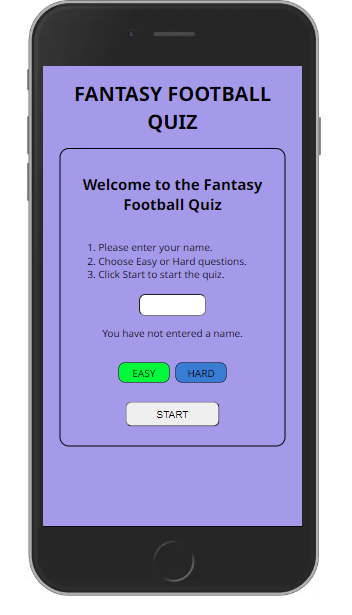

# Fantasy Football Quiz

## Introduction

The Fantasy Football Quiz is for people who play the Fantasy Premier League Fantasy Football game. There are currently over 10 million players worldwide. The questions in the quiz are regarding what players get points for in the Fantasy Football game.

## Table of Contents

* [User Stories](#user-stories)
* [Wireframes](#wireframes)
* [Design](#design)
* [Features](#features)
* [Responsiveness](#responsiveness)
* [Testing](#testing)
* [Deployment](#deployment)
* [Credits](#credits)

## User Stories

* As a user I want to test my knowledge about the Fantasy Premier League Fantasy Football game.
* As a user I want to be able to enter my name before I start the quiz.
* As a user I want to be able to choose an answer from a selection of possible choices.
* As a user I want to know if I got the question correct or incorrect.
* As a user I want to how many questions I got correct as I go through the questions.
* As a user I want to know my total score at the end of the game.
* As a user I want to be told how well I did and if I can improve.

## Wireframes

I used [Balsamiq](https://balsamiq.com/) to create wireframes for my website to plan the layout of the pages. I found this very useful when I started writing the code for the website.

* Mobile View

  * [Welcome Area](documentation/wireframes/mobile-welcome-area.png)
  * [Question Area](documentation/wireframes/mobile-question-area.png)
  * [Results Area](documentation/wireframes/mobile-result-area.png)

* Tablet View

  * [Welcome Area](documentation/wireframes/tablet-welcome-area.png)
  * [Question Area](documentation/wireframes/tablet-question-area.png)
  * [Results Area](documentation/wireframes/tablet-result-area.png)

* Laptop/Desktop View

  * [Welcome Area](documentation/wireframes/desktop-welcome-area.png)
  * [Question Area](documentation/wireframes/desktop-question-area.png)
  * [Results Area](documentation/wireframes/desktop-result-area.png)

[Back to Top](#fantasy-football-quiz)

## Design

### Color Scheme

* I chose rgb(164, 152, 237) for the background color because the color people associate most with Fantasy Football is purple.
* I google the official colors of the Fantasy Football website but the purple they use (rgb(56,0,60)) was too dark to see the features on my quiz. They use it for banners on the website.
* They also use a light blue color rgb(4,245,255) but this was too bright for my quiz. I used a similar light blue (aqua) for the message background in the Results area.
* I used rgb(53, 124, 216) and rgb(19, 251, 19) for the "Easy" and "Hard" buttons to make them stand out on the screen and they look good against the background color.
* I chose green and red for correct and incorrect answers as these are known worldwide as positive and negative respectively.

### Font

* I decided to use the "Noto Sans" font family for my website.
* I googled the top ten font families to use on websites and I thought "Noto Sans" was the a good font for a quiz. There is not much text on the screen at any one time so I wanted it to stand out more to make it look more like a game.
* I imported them from [Google Fonts](https://fonts.google.com/)

[Back to Top](#fantasy-football-quiz)

## Features

### Welcome Area

* The Welcome Area has a message at the top to welcome the user to the quiz.
* The user is asked to enter their name in the box underneath and chose a level of difficulty, easy or hard.
* The "Easy" button is initially selected and the questions are set to the easy questions when the quiz is loaded.
* Next the user must click the "Start" button to start the quiz. This will hide the Welcome Area and display the Question Area.

* If the user clicks "Start" without entering a name, a message will appear above the difficulty level buttons to inform them of this.
* The "Start" button will not work until they have entered a name.

### Question Area

* When the Question Area is loaded/displayed the user's name is displayed at the top and their current score.
* When the user get a question right their score increase by 1.
* The question number is displayed underneath and the number increases by 1 every time the user clicks on the "Next Question" button.
* Below this is the current question. This also changes when the user clicks on the "Next Question" button.
* Next is the three possible answers to the current question. These also change for each question.
* The "Next Question" button allows the user to move to the next question. 
* The "Play Again" button will work at anytime if user wishes to start the quiz again.
* The "Results" button is disabled until the user answers all the questions. 

* When the user clicks on the correct answer, the answer they clicked on turns green.
* A message is displayed below the answers to inform them of this.
* When the user clicks on the "Next Question" button, this message will disappear.

* When the user clicks on an incorrect answer, the answer they clicked on turns red.
* A message is displayed below the answers to inform them of this.

### Results Area

[Back to Top](#fantasy-football-quiz)

## Responsiveness

[Back to Top](#fantasy-football-quiz)

## Testing

[Back to Top](#fantasy-football-quiz)

## Deployment

[Back to Top](#fantasy-football-quiz)

## Credits

[Back to Top](#fantasy-football-quiz)
